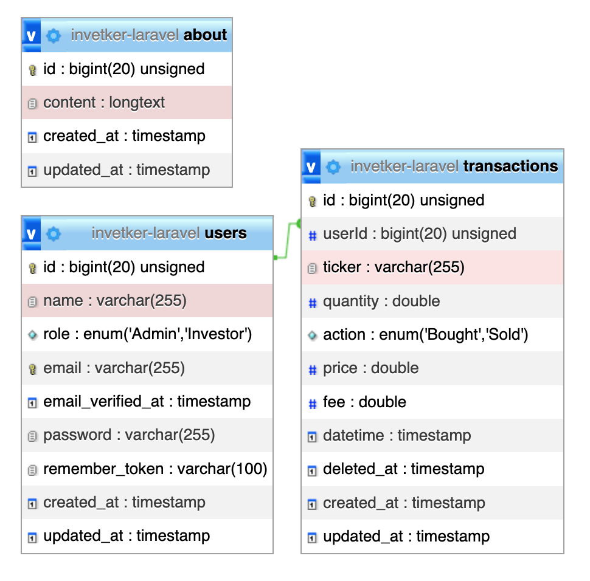
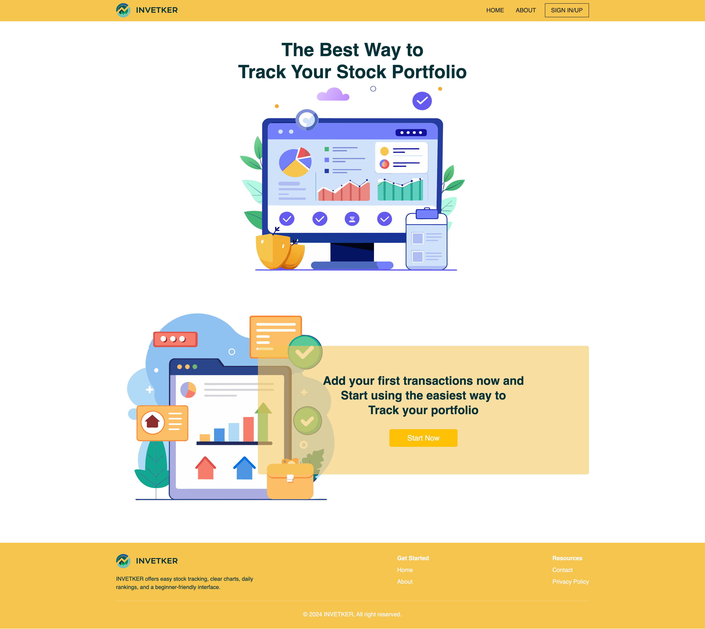
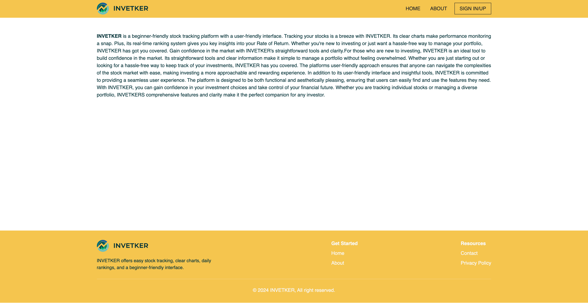
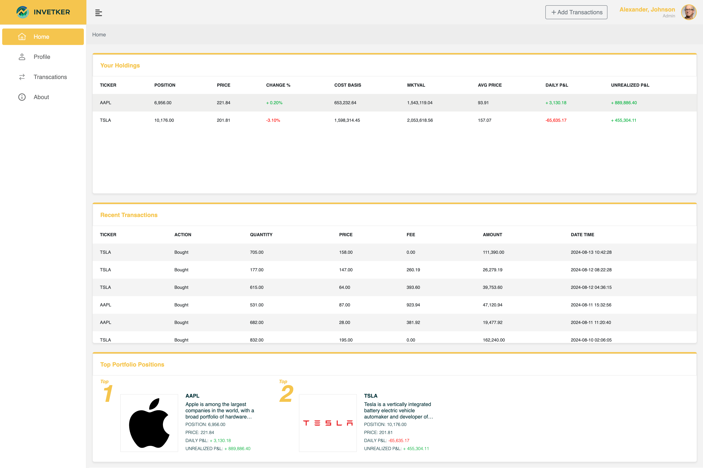
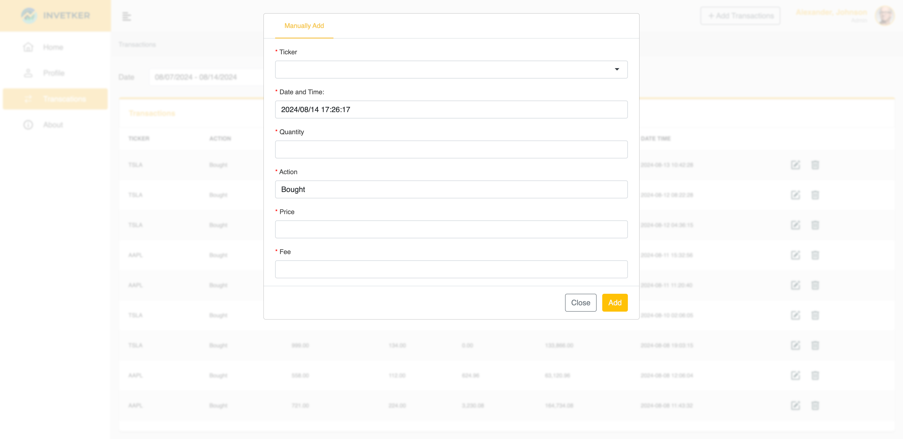
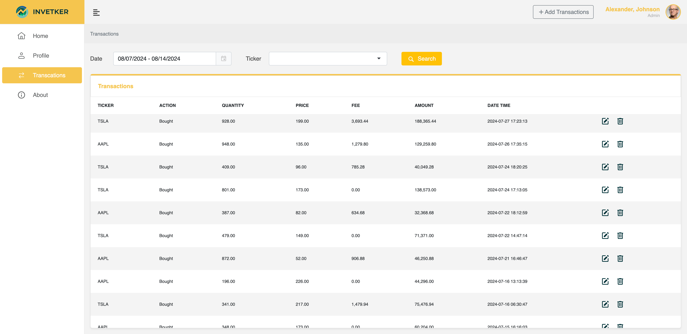

<p align="center">
  
</p>

# Invetker


## Introduction
INVETKER is a beginner-friendly platform designed to simplify stock tracking with an intuitive interface. It offers clear charts for easy performance monitoring and a real-time ranking system to provide key insights into your rate of return. Ideal for new investors or those seeking an effortless portfolio management solution, INVETKER delivers straightforward tools and clarity to help you gain confidence in the market.

## Objectives
- Simplify portfolio tracking across multiple brokerage accounts.
- Efficiently identify the best investment advisor.

## Features
INVETKER provides users with a robust platform for managing their U.S. stock investments. Users can create and manage multiple investment portfolios, each dedicated to tracking various U.S. stocks. The platform allows users to add, edit, and remove stocks within their portfolios. For each stock, users can view key details such as the current price, purchase price, quantity held, and the overall gain or loss. The system offers an overview of the portfolio’s total value and performance, helping users make informed investment decisions. The interface is user-friendly, facilitating easy portfolio management and performance tracking.

## Database Schema


The database schema for INVETKER is designed to effectively manage user data and stock transactions.

The Users table holds essential information, including usernames, unique emails, and securely hashed passwords.

The Transactions table links to the Users table with a foreign key (userId), allowing each user to create and manage multiple portfolios. This table includes details such as ticker symbols, purchase prices, quantities, fees, actions, and purchase dates.

The About table records the product description that will be displayed on the front page.

## Installation
1. Set Up Environment Configuration:
 - Duplicate the `env.sample.php` file and rename it to `env.php`.
 - Open `env.php` and update it with your environment-specific settings.
2. Install PHP Dependencies:
```
composer install
```
3. Run Database Migrations:
```
php artisan migrate
```
4. Seed the Database:
```
php artisan db:seed
```
5. Install JavaScript Libraries:
```
npm i
```
6. Compile and Bundle Assets:
```
npm run dev
```
7. Launch the Development Server:
```
php artisan serve
```

## Screenshots

**Home**


**About** - The content can be updated by an admin.


**Dashboard** - Displays all holdings with current profit for the user, recent transactions, and top portfolio positions along with ticker information.


**Add Transaction** - Allows users to add transactions, requiring the ticker, quantity, action, price, fee, and date/time.


**Transactions** - Displays all transactions for the current user and allows the user to customize filters by ticker or date.

## Notes
1. Integrating the Polygon API: This API provides stock information. Please note that the free plan allows only 5 requests per minute.
2. Admin Access: The "dashboard/about" page is accessible only to admins. The DatabaseSeeder will automatically add an admin account upon import, with the following credentials: (Email: service@good-series.com, Password: 12345678).
3. Responsive Web Design: All pages support responsive web design (RWD).

---

## References

Wireframe: https://www.figma.com/proto/TF7iwR3XOIAfW4w1ThJiEE

Gravatar: https://docs.gravatar.com/

Polygon.io: https://polygon.io/docs/stocks/getting-started

## Contributors

* Designer: [joeyin](https://www.linkedin.com/in/chiweiyin/)
* Developer: [joeyin](https://www.linkedin.com/in/chiweiyin/)
